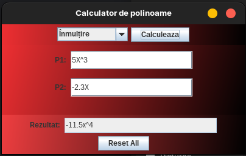

# Polynomial calculator

## Description
A polynomial calculator implemented with an MVC (Model-View-Controller) architecture.

## Purpose
The current project can work with both numbers and polynomials.  
Possible operations:
- addition
- substraction
- multiplying
- division (even of polynomials)
- integration
- derivation

## Modules
Two main folders: `src` and `test`.  
Deep under `src` can be found:
- `Data_Models` package (contains Monom and Polinom classes)
- `GUI` package (where MVC architecture lays)
- `ro_tuc` package
  - `App.java` is the starting point of the application

Under `test` can be found `OperationsTest.java` (our tests).

## Dependencies
Maven was used to ease dependency injection.  
JUnit was one dependency we used for Unit Testing.